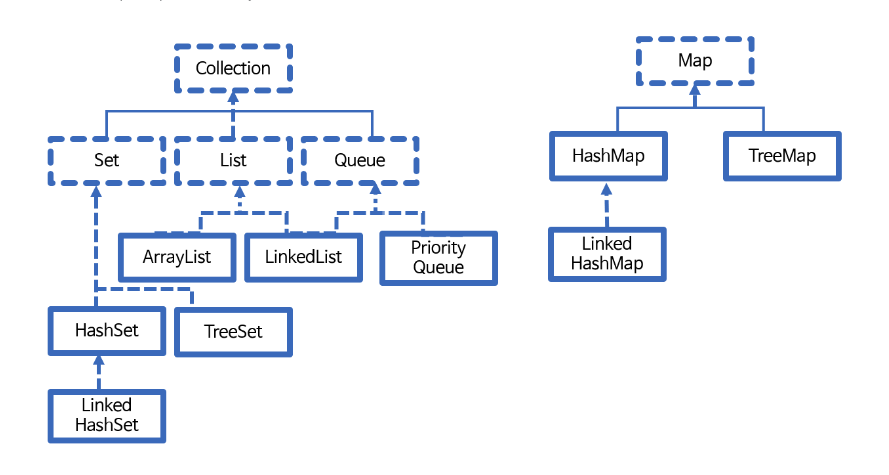

### 자바 컬렉션
`Collection 이란?`
- 목록성 데이터를 처리하는 자료구조
- 하나의 데이터가 아닌 여러 데이터를 담을때 사용
- java.util

`자바의 자료구조`
- 순서가 있는 List 형
- 순서가 중요하지 않은 Set 형
- 먼저 들어온 것이 먼저 나가는 Queue 형
- Key-Value로 저장되는 Map 형
- 참고 관계도


`Collection Interface`
```java
public interface Collection<E> extends Iterable<E>
```
| 리턴 타입          | 메소드 이름 및 매개 변수 |
|----------------|----------------|
| Iterator < T > | iterator()     |

-> Collection 인터페이스는 Iterable 인터페이스를 확장했다. 
이 의미는 Iterator 인터페이스를 사용하여 데이터를 순차적으로 가져올 수 있다.