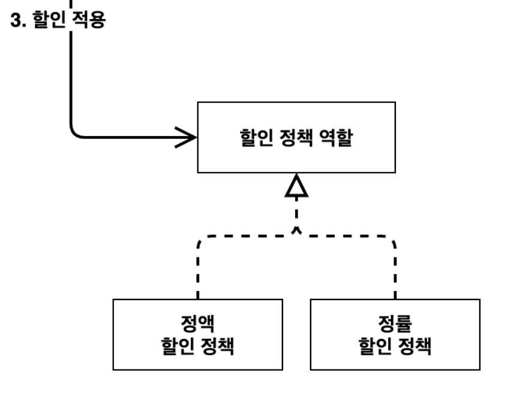

## 외부에서 주입(DI)
### 1. 할인정책
1. 기본 정책은 고정 할인이지만 추후 변경될 수 있다.
2. 이에 맞게 인터페이스를 설계하자

`인터페이스 설계`


`설계에 따른 코드`
- 할인 정책 Interface
```java
public interface DiscountPolicy {
    /**
     * @return 할인 대상 금액
     */
    int discount(Member member, int price);
}
```
- 고정 할인
~~~ java
public class FixDiscountPolicy implements DiscountPolicy{

    private int discountFixAmount = 1000;

    @Override
    public int discount(Member member, int price) {
        if (member.getGrade() == Grade.VIP) {
            return discountFixAmount;
        }else return 0;
    }
}
~~~
- 주문 Service
~~~ java
public class OrderServiceImpl implements OrderService {

   private final MemberRepository memberRepository = new MemoryMemberRepository();
   private final DiscountPolicy discountPolicy = new FixDiscountPolicy();
   @Override
    public Order createOrder(Long memberId, String itemName, int itemPrice) {

        Member member = memberRepository.findById(memberId);
        int discountPrice = discountPolicy.discount(member, itemPrice);

        return new Order(memberId, itemName, itemPrice, discountPrice);
    }
}
~~~
-> 주문 Service의 경우 MemberRepository와 DiscountPolicy를 의존하고 있다.

## 2. 변경된 할인 정책
- 만약 고정 할인에서 정액 할인율로 바뀐다면?
- 코드 추가 (정액 할인 로직)
~~~ java
public class RateDiscountPolicy implements DiscountPolicy {

    private int discountPercent = 10;

    @Override
    public int discount(Member member, int price) {
        if (member.getGrade() == Grade.VIP) {
            return price * discountPercent / 100;
        }else {
            return 0;
        }
    }
}
~~~ 
- Service 코드 변경
~~~ java
public class OrderServiceImpl implements OrderService {

   private final MemberRepository memberRepository = new MemoryMemberRepository();
   // private final DiscountPolicy discountPolicy = new FixDiscountPolicy();
   private final DiscountPolicy discountPolicy = new RateDiscountPolicy();
~~~ 

`무엇이 문제일까?`
1. 구현과 역할을 분리했나? OK
2. 다형성 활용 및 인터페이스를 구현했나? OK
3. 객체지향 설계 원칙을 지켰나? NO
   - DIP : Service는 추상과 구현 클래스에 의존한다.(DiscountPolicy, RateDiscountPolicy)
   - OCP : 구현에 의존하다 보니 고정 할인율 -> 정액 할인율 정책이 변경되면서 코드도 변경이 된다.

## 3. 관심사의 분리
- 2번에서의 문제를 해결하는 방법은 관심사를 분리시키는 것이다.

`공연 기획자의 역할`
- 공연 기획자의 경우, 공연을 구성하고 배우를 캐스팅하고 역할에 맞는 배우를 지정한다.
- 공연 기획자의 역할이 필요하다.

`AppConfig`
- AppConfig를 만들어 구현 객체를 생성하고 연결하는 책임을 부여하자
~~~ java

public class AppConfig {

     public OrderService orderService() {
        // 생성자 주입
        return new OrderServiceImpl(new MemoryMemberRepository(), new FixDiscountPolicy());
    }
}
~~~
- Service 코드 수정
~~~ java
public class MemberServiceImpl implements MemberService{

    private final MemberRepository memberRepository;
    private final DiscountPolicy discountPolicy;

    public OrderServiceImpl(MemberRepository memberRepository, DiscountPolicy discountPolicy) {
        this.memberRepository = memberRepository;
        this.discountPolicy = discountPolicy;
    }


~~~
코드가 수정이 되면서
- Service는 구현이 아닌 추상(interface)에 의존
- 생성자를 통해 어떤 객체가 들어오는지 알 수 없다.
- 어떤 객체를 넣어줄지는 AppConfig에서 알 수 있다.
